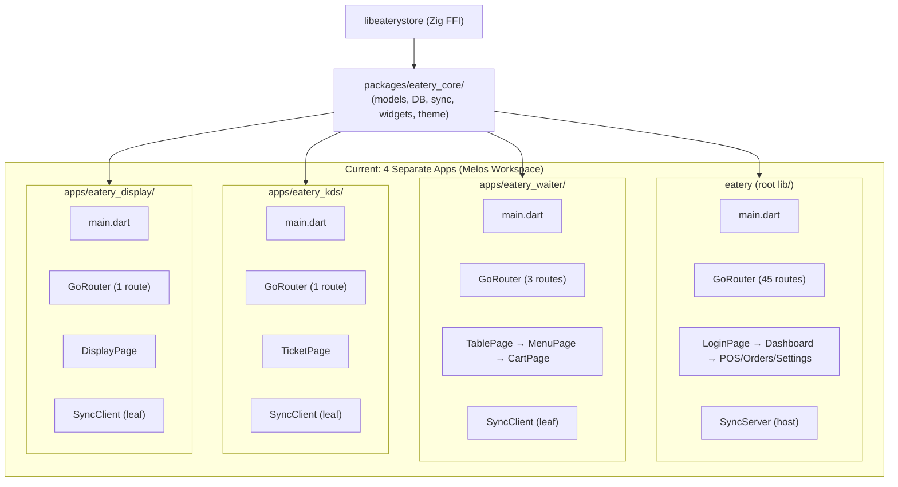
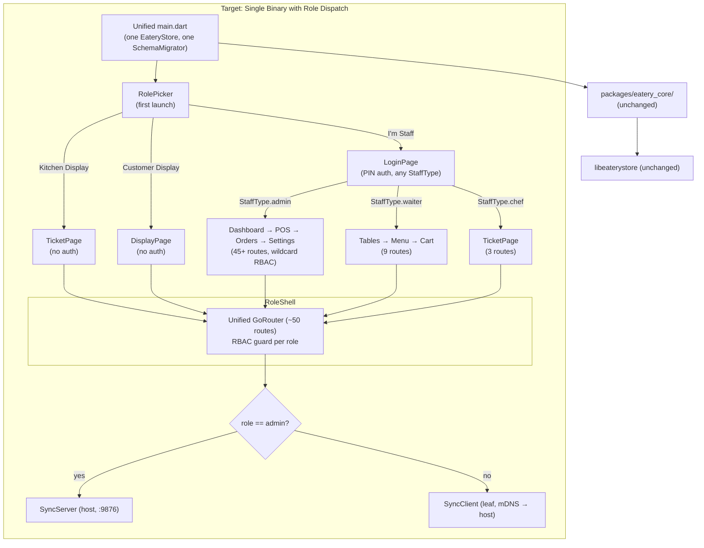
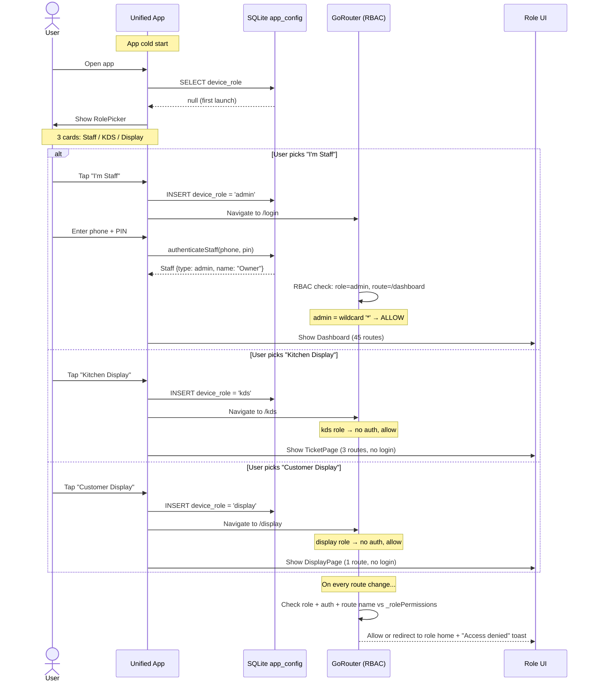

# Single-App Architecture Unification — Issues

> **Epic:** Merge 4 Melos sub-apps (Admin, Waiter, KDS, Display) into one Flutter binary with role-based UI dispatch, RBAC-protected routing, and unified sync initialization. Delete `apps/` entirely.
>
> ✅ **All 28 issues are completed.** See the [Smoke Test Checklist](#smoke-test-checklist) below for manual verification scenarios.

---

## Issue Table

| # | Phase | Issue | Description | Depends On | Affected Files | Effort | Priority | Status |
|---|-------|-------|-------------|------------|----------------|--------|----------|--------|
| **01** | 1 | `app_config` migration | **Table already exists** — `SchemaMigrator._ensureConfigTable()` creates `app_config` and `SyncHostConfig` also ensures it via `CREATE TABLE IF NOT EXISTS`. This issue is **only** about adding a read/write path for the `device_role` key (values: `admin`, `waiter`, `kds`, `display`). Add a `setDeviceRole(String role)` / `getDeviceRole()` convenience pair that writes/reads via `INSERT OR REPLACE` and `SELECT value WHERE key = 'device_role'`. No schema version bump needed. | — | `packages/eatery_core/lib/data/database/native/schema_migrator.dart` (add read/write methods only) | S | 🔴 P0 | ✅ |
| **02** | 1 | `roleProvider` Riverpod provider | Create a `StateProvider<String?>` that reads the current `device_role` from `app_config` on startup. Must be initialized before the widget tree mounts. Expose a `setRole(String role)` convenience method that writes back to `app_config`. | 01 | `packages/eatery_core/lib/providers/` (new file: `role_provider.dart`) | S | 🔴 P0 | ✅ |
| **03** | 1 | Role picker screen | Full-screen UI shown on first launch when `device_role` is unset. Three cards: "**I'm Staff**" → saves `admin` role and navigates to `/login`, "**Kitchen Display**" → saves `kds` role and navigates to `/kds`, "**Customer Display**" → saves `display` role and navigates to `/display`. Support `--dart-define=role=display` (and `waiter`/`kds`/`admin`) to skip the picker entirely during local dev. **Conflict resolution:** `--dart-define` overrides `app_config` at runtime — if both are set, the dart-define wins. If neither is set, show the picker. The dart-define value is *not* persisted to `app_config` (it's a dev-only convenience). Use the provided `SelectableCard` component to match the existing visual language. | 02 | `lib/pages/role_picker.page.dart` (new) | M | 🔴 P0 | ✅ |
| **04** | 2 | Unify `lib/main.dart` entry point | Merge the 4 separate `main.dart` files (root + 3 sub-apps) into one. Open `EateryStore` once at startup. Load schema + run `SchemaMigrator`. After store is ready, decide sync role based on `device_role`: `admin` → `SyncConfig.host(port: 9876)`, others → `SyncConfig.leaf(hostAddress: ...)` **after mDNS discovery** (call `MdnsService.discoverHosts()` first; fallback to `localhost` if discovery returns empty). Handle the case where no role is set yet — skip sync init entirely until role is chosen via the picker (sync initializes lazily when role is persisted). Keep platform permission checks (storage, camera, location) from the admin app. | 02 | `lib/main.dart` | L | 🔴 P0 | ✅ |
| **05** | 2 | `RoleShell` entry widget | Replace the current `MyApp` widget that wraps `MaterialApp.router` with `AppAdaptiveShell`. New `RoleShell` reads `roleProvider` and `authSessionProvider` and dispatches: `null`→`RolePickerPage`, `display`→`DisplayPage`, `kds`→`LoginPage` or KDS grid if already authenticated, `waiter`→`LoginPage` or tables if authenticated, `admin`→existing flow (MainScreen / Login / Dashboard). Display/KDS should bypass authentication entirely — no login gate. The shell should render a single `MaterialApp.router` with the unified GoRouter. | 03, 04 | `lib/main.dart` (inline or new `lib/core/shell/role_shell.dart`) | L | 🔴 P0 | ✅ |
| **06** | 3 | Route permission map | Define a `_rolePermissions` constant mapping each role to the set of GoRouter route names it is allowed to access. Admin gets wildcard `'*'`, waiter gets `tables, menu, cart, orders, viewOrder, orderConfirmation, orderPrint, customers, viewCustomer`, kds gets `kds, viewOrder, orderConfirmation`, display gets `display, viewOrder`. Place this in `app_router.dart` alongside the router definition. | — | `lib/core/router/app_router.dart` | S | 🔴 P0 | ✅ |
| **07** | 3 | Merge waiter routes into GoRouter | Absorb the 3 waiter routes from `apps/eatery_waiter/lib/router.dart` into the unified router. Rename the waiter root `/` to `/tables` to avoid collision. Keep `/menu` and `/cart` as-is (they are waiter-specific; the admin POS page is at `/pos`). Import pages from `lib/pages/waiter/`. | 10, 06 | `lib/core/router/app_router.dart` | S | 🔴 P0 | ✅ |
| **08** | 3 | Merge KDS routes into GoRouter | Absorb the KDS route from `apps/eatery_kds/lib/router.dart`. Rename root `/` to `/kds`. Import pages from `lib/pages/kds/`. | 11, 06 | `lib/core/router/app_router.dart` | S | 🔴 P0 | ✅ |
| **09** | 3 | Merge Display routes into GoRouter | Absorb the Display route from `apps/eatery_display/lib/router.dart`. Rename root `/` to `/display`. Import pages from `lib/pages/display/`. | 12, 06 | `lib/core/router/app_router.dart` | S | 🔴 P0 | ✅ |
| **10** | 3 | Role-based root redirect | Route `/` must redirect based on role: `display`→`/display`, `kds`→`/kds`, `waiter`→`/tables`, `admin`→`/dashboard` (or `/login` if not authenticated). Add a `redirect` on the `/` route that reads `roleProvider` and `authSessionProvider`. | 02, 06 | `lib/core/router/app_router.dart` | S | 🔴 P0 | ✅ |
| **11** | 3 | RBAC redirect guard | Replace the current simple auth redirect in `app_router.dart` with a role-aware guard. Logic: (1) no role set → `/role-picker`, (2) role is `display` or `kds` → no auth required, but block routes not in `_rolePermissions[role]`, (3) staff roles (`admin`/`waiter`) → must be authenticated or redirect to `/login`, (4) authenticated staff → check route name against `_rolePermissions[role]`, unauthorized redirects to role's home. Unauthorized redirects should show a toast with "Access denied". **⚠️ Complexity note:** This is 4 role types × auth checks × permission map × toast/redirect — the guard function will be ~60-80 lines. If it grows larger, split into `_redirectForRole()`, `_redirectForStaff()`, `_redirectForKiosk()` helpers. **⚠️ Waiter/KDS auth:** These roles have zero auth in the current sub-apps. This guard must handle the case where they *do* log in (future) and where they *don't* (current state). See issue 11a below. | 02, 06 | `lib/core/router/app_router.dart` | L | 🔴 P0 | ✅ |
| **11a** | 3 | Waiter/KDS auth integration | **New:** The waiter and KDS sub-apps currently have **zero authentication** — there is no login screen, no PIN check, no `authSessionProvider` usage. For the RBAC guard in issue 11 to work properly, we need to decide: (a) add full PIN login to waiter/KDS (StaffType.waiter / StaffType.chef log in via the existing `LoginPage`), or (b) allow unauthenticated access to waiter/KDS routes for now (i.e., `display`/`kds`-style bypass). **Recommendation:** Option (a) — reuse the existing `LoginPage` and `authenticateStaff()` for all staff roles. The login screen already works for admin; extending to waiter/chef requires only creating staff records of those types. This also means smoke tests S3 and S4 both work the same way. | 11 | `lib/pages/authentication/login.page.dart` (minor), seed data (add waiter/chef staff records) | M | 🟡 P1 | ✅ |
| **12** | 3 | Delete sub-app router & app files | Remove `apps/eatery_waiter/lib/router.dart`, `apps/eatery_waiter/lib/app.dart`, `apps/eatery_kds/lib/router.dart`, `apps/eatery_kds/lib/app.dart`, `apps/eatery_display/lib/router.dart`, `apps/eatery_display/lib/app.dart`. These are replaced by the unified `app_router.dart` and `RoleShell`. | 07, 08, 09 | See description | S | 🔴 P0 | ✅ |
| **13** | 4 | Move Waiter pages | Move 3 files: `apps/eatery_waiter/lib/pages/table_page.dart` → `lib/pages/waiter/table_page.dart`, `apps/eatery_waiter/lib/pages/menu_page.dart` → `lib/pages/waiter/menu_page.dart`, `apps/eatery_waiter/lib/pages/cart_page.dart` → `lib/pages/waiter/cart_page.dart`. Update import paths from `package:eatery_waiter/...` references — these pages currently only import `package:eatery_core/...`, `package:flutter/...`, and `package:flutter_riverpod/...`, so no import changes needed. | — | `lib/pages/waiter/table_page.dart` (new), `lib/pages/waiter/menu_page.dart` (new), `lib/pages/waiter/cart_page.dart` (new) | S | 🟡 P1 | ✅ |
| **14** | 4 | Move KDS pages | Move 2 files: `apps/eatery_kds/lib/pages/ticket_page.dart` → `lib/pages/kds/ticket_page.dart`, `apps/eatery_kds/lib/pages/home_page.dart` → `lib/pages/kds/home_page.dart`. These pages only import `package:eatery_core/...` and standard Flutter packages — no import changes needed. | — | `lib/pages/kds/ticket_page.dart` (new), `lib/pages/kds/home_page.dart` (new) | S | 🟡 P1 | ✅ |
| **15** | 4 | Move Display pages | Move 2 files: `apps/eatery_display/lib/pages/display_page.dart` → `lib/pages/display/display_page.dart`, `apps/eatery_display/lib/pages/home_page.dart` → `lib/pages/display/home_page.dart`. These pages only import `package:eatery_core/...` and standard Flutter packages — no import changes needed. | — | `lib/pages/display/display_page.dart` (new), `lib/pages/display/home_page.dart` (new) | S | 🟡 P1 | ✅ |
| **16** | 4 | Delete `apps/` directory | Remove `apps/eatery_waiter/`, `apps/eatery_kds/`, `apps/eatery_display/` in their entirety. All code has been migrated into `lib/pages/`, all routes have been absorbed into the unified GoRouter. No references should remain. | 12, 13, 14, 15 | `apps/` (delete) | S | 🟡 P1 | ✅ |
| **17** | 5 | Update `pubspec.yaml` | Remove only the `apps/*` entries from the `workspace:` block. **Keep `packages/*`** — `packages/eatery_core` stays as a `path: packages/eatery_core` dependency (it is referenced in the root `dependencies:` section, not just the workspace). The workspace block becomes `workspace: [packages/*]` or is removed entirely if Melos workspace resolution is no longer needed. Keep `melos` as `dev_dependencies` but update the `melos:` scripts block to target the single root package. Keep all code-gen deps. **Verify `eatery_core` path dependency still resolves** after the workspace change by running `flutter pub get`. | 16 | `pubspec.yaml` | S | 🟡 P1 | ✅ |
| **18** | 5 | Reconstitute Melos scripts | Update the `melos:` block to work without workspace packages. Scripts: `analyze` → `flutter analyze --no-fatal-infos --no-fatal-warnings lib/`, `test` → `flutter test`, `format` → `dart format .`, `get` → `flutter pub get`, `build:admin` → `flutter build macos --debug`. Remove `analyze:all` (was workspace-wide). | 17 | `pubspec.yaml` | S | 🟡 P1 | ✅ |
| **19** | 5 | Merge Android manifests | Diff the 3 sub-app `AndroidManifest.xml` files against the root manifest. The sub-apps are scaffold apps with minimal config — if any extra permissions or activities exist, merge them into the root `android/app/src/main/AndroidManifest.xml`. If identical (likely), document as "no changes needed" and close. | 16 | `android/app/src/main/AndroidManifest.xml` (maybe) | S | 🟢 P2 | ✅ |
| **20** | 5 | Merge iOS plists | Same as 19 but for `ios/Runner/Info.plist`. Check sub-app plists for unique keys (custom URL schemes, background modes, etc.) and merge if found. | 16 | `ios/Runner/Info.plist` (maybe) | S | 🟢 P2 | ✅ |
| **21** | 6 | Remove hardcoded device IDs | `sync_providers.dart` has `const kHostDeviceId = 'eatery-admin'`. This should derive from `roleProvider` instead — admin role means host, others mean leaf. The `SyncConfig.host()` factory should accept an optional `deviceId` instead of hardcoding. Update all call sites. | 04 | `packages/eatery_core/lib/data/sync/sync_providers.dart` | S | 🟡 P1 | ✅ |
| **22** | 6 | Remove `SyncInitializer` widgets | Each sub-app had its own `SyncInitializer` in `main.dart` that handled mDNS discovery and `syncInitProvider` invocation. This is now handled once in the unified `main.dart`. Delete the `SyncInitializer` class definitions from the moved pages (they live in the old `main.dart` files that are deleted in issue 16, so this is mostly verification that no references remain). | 16 | Verification only — no code changes expected | S | 🟡 P1 | ✅ |
| **23** | 6 | Clean `references.dart` barrel file | Review `lib/references.dart` for any exports that reference sub-app packages or paths that no longer exist. Remove stale entries. | 16 | `lib/references.dart` | S | 🟢 P2 | ✅ |
| **24** | 6 | Regenerate build_runner code | Run `dart run build_runner build --delete-conflicting-outputs` to regenerate all `*.freezed.dart`, `*.g.dart`, and riverpod provider files. This ensures the single-package setup produces correct generated code. Fix any generation errors. | 17 | `*.freezed.dart`, `*.g.dart`, generated riverpod files (auto-generated) | M | 🟡 P1 | ✅ |
| **25** | 6 | Static analysis pass | Run `flutter analyze --no-fatal-infos --no-fatal-warnings lib/`. Fix all errors and warnings. Common issues to expect: unused imports from deleted sub-apps, missing exports in barrel files, route references to deleted pages. | 24 | All `lib/` files (fix as needed) | M | 🟡 P1 | ✅ |
| **26** | 6 | Test suite pass | Run `melos run test` (`flutter test`). All existing tests must pass. If any tests reference sub-app packages or deleted files, update or remove them. | 24, 25 | `test/` directory | M | 🟡 P1 | ✅ |
| **27** | 5 | Document `eatery_core` path dependency | After removing `apps/*` from the workspace, `packages/eatery_core` is the only remaining sub-package. Ensure it's declared as a `path:` dependency in the root `pubspec.yaml` (`eatery_core: path: packages/eatery_core`). Verify the import `package:eatery_core/...` works in all files under `lib/`. If Melos workspace is fully removed, this becomes a standard path dependency. | 17 | `pubspec.yaml`, verify `lib/` imports | S | 🟡 P1 | ✅ |

---

## Smoke Test Checklist

| # | Scenario | Steps | Expected Result |
|---|----------|-------|-----------------|
| S1 | First launch | Fresh install → open app | Role picker screen appears with 3 options |
| S2 | Pick Staff role | Tap "I'm Staff" → role saved | Redirected to `/login`. Role persists across app restarts. |
| S3 | Staff login → admin | Login as admin (StaffType.admin). The login screen accepts **either** a name (`admin`) or phone (`555-0100`) plus PIN (`1234`). | Redirected to `/dashboard` with full admin menu |
| S4 | Staff login → waiter | Login as waiter (StaffType.waiter). Use name (`Waiter 1`) or phone (`555-0101`) plus PIN (`1111`). | Redirected to `/tables` with waiter view |
| S5 | Pick Kitchen Display | Tap "Kitchen Display" | Auto-starts KDS ticket grid. No login prompt. |
| S6 | Pick Customer Display | Tap "Customer Display" | Auto-starts order status display. No login prompt. |
| S7 | `--dart-define=role=display` | Launch with `flutter run --dart-define=role=display` | Skips role picker, goes directly to display |
| S8 | RBAC: waiter blocked | Login as waiter, manually navigate to `/settings` | Redirected to `/tables` with "Access denied" toast |
| S9 | RBAC: kds blocked | Launch as KDS, navigate to `/pos` | Redirected to `/kds` with "Access denied" toast |
| S10 | RBAC: display blocked | Launch as Display, navigate to `/customers` | Redirected to `/display` with "Access denied" toast |
| S11 | RBAC: admin unrestricted | Login as admin, navigate to any route | All routes accessible |
| S12 | Admin sync server | Login as admin, check sync status | `SyncService` reports `SyncRole.host`, WebSocket listening on port 9876 |
| S13 | Waiter sync client | Login as waiter on same LAN | mDNS discovers admin, connects as leaf, `SyncStatus` shows `connected` |
| S14 | KDS sync client | Launch KDS on same LAN | Connects to admin via mDNS, receives order broadcasts |
| S15 | Display sync client | Launch Display on same LAN | Connects to admin via mDNS, shows live order status |
| S16 | DB persistence | Add a product as admin, kill app, relaunch as admin | Product still present in the database |
| S17 | Role locked | After choosing display role, kill and relaunch app | Goes directly to display (no picker) |
| S18 | Reset role | Add a method or dev button to clear `device_role` | Role picker reappears on next launch |
| S19 | Android build | Run `flutter build apk --debug` | Build succeeds, APK is produced |
| S20 | iOS build (macOS host) | Run `flutter build ios --no-codesign` | Build succeeds without code signing errors |
| S21 | macOS build | Run `flutter build macos --debug` | Build succeeds, app launches on macOS |

---

## Rollback Strategy

If the unified app breaks production, revert by reversing the migration order:

1. **Checkout the pre-migration commit** — all `apps/` directories are versioned in git, so a simple `git checkout <commit>` restores everything.
2. **Rebuild sub-apps** — run `melos bootstrap` from the old workspace to restore sub-app dependencies.
3. **Reinstall on devices** — build each sub-app separately (`flutter build apk` in each `apps/` directory) and reinstall.

**Safety net:** Before deleting `apps/` (issue 16), tag the current commit as `pre-unification`. If anything goes wrong, `git checkout pre-unification` instantly restores all 4 separate apps.

---

## Dependency Graph

```
01 (app_config read/write for device_role)                        │
 └─ 02 (roleProvider)                                              │
     ├─ 03 (RolePicker page + --dart-define override)              │
     │   └─ 05 (RoleShell) ────────────────────────────────────┐  │
     └─ 04 (Unified main.dart + mDNS + localhost fallback)      │  │
         └─ 05 (RoleShell) ────────────────────────────────────┤  │
                                                                │  │
06 (permission map)                                              │  │
 ├─ 07 (Waiter routes) ─────────────────────────────────────────┤  │
 │   ├─ 12 (delete sub-app routers)                             │  │
 │   └─ 10 (root redirect) ─────────────────────────────────────┤  │
 ├─ 08 (KDS routes) ────────────────────────────────────────────┤  │
 │   ├─ 12                                                      │  │
 │   └─ 10 ─────────────────────────────────────────────────────┤  │
 ├─ 09 (Display routes) ────────────────────────────────────────┤  │
 │   ├─ 12                                                      │  │
 │   └─ 10 ─────────────────────────────────────────────────────┤  │
 ├─ 11 (RBAC redirect guard) ───────────────────────────────────┤  │
 │   └─ 11a (Waiter/KDS auth integration) ──────────────────────┤  │
 └─ 10 (Role-based root redirect) ──────────────────────────────┘  │
                                                                    │
13 (Move waiter pages) ─┐                                           │
14 (Move KDS pages) ────┤                                           │
15 (Move Display pages) ┤                                           │
 └─ 16 (Delete apps/)  ─┤                                           │
    ├─ 17 (pubspec.yaml — keep packages/*) ─────────────────────────┤
    │   ├─ 18 (Melos scripts)                                       │
    │   ├─ 24 (build_runner)                                        │
    │   └─ 27 (eatery_core path dep docs)                           │
    ├─ 19 (Android manifest merge)                                  │
    └─ 20 (iOS plist merge)                                         │
                                                                    │
21 (Remove hardcoded device IDs) ───────────────────────────────────┤
22 (Remove SyncInitializer) ────────────────────────────────────────┤
23 (Clean references.dart) ─────────────────────────────────────────┤
                                                                    │
24 (build_runner regen) ────────────────────────────────────────────┤
 ├─ 25 (Static analysis)                                            │
 └─ 26 (Test suite) ────────────────────────────────────────────────┘
```

---

## Summary

| Metric | Count |
|--------|-------|
| Total issues | 28 | ✅ All 28 completed |
| P0 (blocking) | 12 | ✅ |
| P1 (important) | 12 | ✅ |
| P2 (nice-to-have) | 4 |
| New files created | 9 |
| Files modified | 6+ |
| Directories deleted | 4 (`apps/eatery_waiter`, `apps/eatery_kds`, `apps/eatery_display`, `apps/`) |
| Lines of code touched (est.) | ~800 added, ~600 removed, ~200 modified |
| Effort (S/M/L) | 16 S, 8 M, 2 L (pre-review); 15 S, 9 M, 4 L (post-review) |
| Smoke tests | 21 |

---

## Architecture Diagrams

### Current: 4 Separate Apps



### Target: Single Binary with Role Dispatch



### Role-Based RBAC Flow


