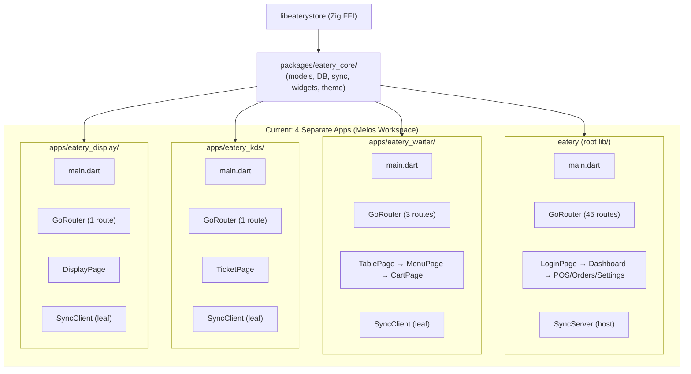
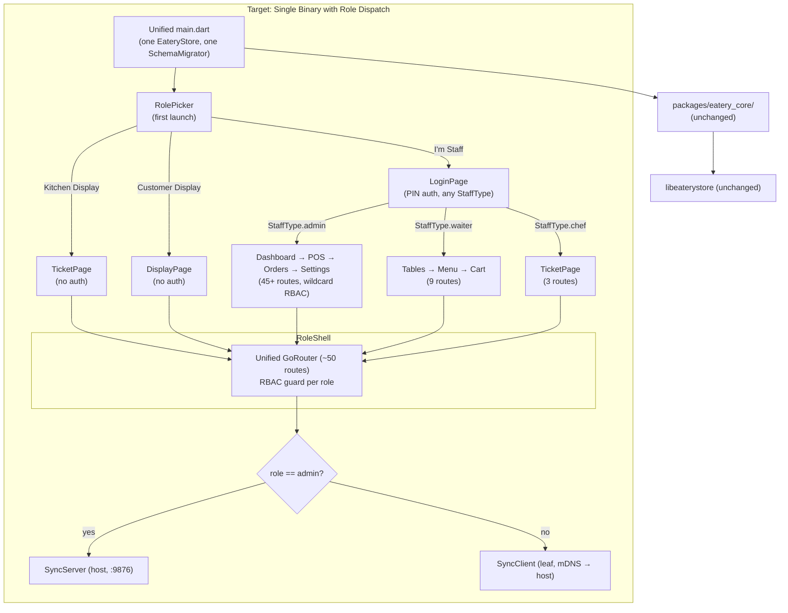
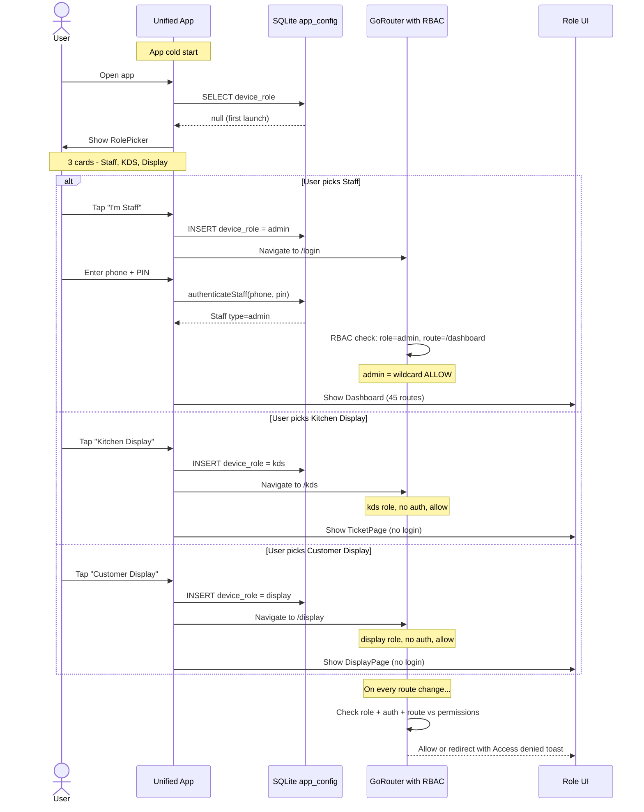

# Single-App Architecture

> **Status:** Complete (Phase 1). All 28 issues resolved. The `apps/` directory is deleted. Single binary dispatches UI by device role at runtime. See [Reconstruction History](../development/reconstruction-history.md) for the full migration timeline.

## Overview

Eatery is moving from 4 separate Flutter binaries (Admin, Waiter, KDS, Display) to a **single unified binary** that dispatches UI by device role at runtime. One app, installed on every device in the restaurant, behaves differently based on whether it's configured as the admin terminal, a waiter tablet, a kitchen display, or a customer-facing screen.

## Architecture Comparison

### Current: 4 Separate Apps (Melos Workspace)



### Target: Single Binary with Role Dispatch



## Role-Based Dispatch Flow



## Key Architectural Shifts

| Aspect | Before | After |
|--------|--------|-------|
| **Apps** | 4 separate binaries | 1 binary, 4 UIs via role dispatch |
| **Entry points** | 4 `main.dart` files | 1 `main.dart` |
| **Routers** | 4 separate `GoRouter` instances | 1 unified `GoRouter` (~50 routes) |
| **Auth** | Admin only (PIN). Waiter/KDS/Display have zero auth | Admin + waiter/chef get PIN login. Display/KDS kiosk modes bypass auth |
| **Sync role** | Hardcoded per app (`kHostDeviceId = 'eatery-admin'`) | Derived from `device_role` in `app_config` — admin=host, others=leaf |
| **Code location** | `apps/eatery_waiter/lib/`, etc. | `lib/pages/waiter/`, `lib/pages/kds/`, `lib/pages/display/` |
| **Build** | `melos exec` across 4 packages | Single `flutter build` |
| **Melos** | Workspace manager for all packages | Dev script runner only (no workspace wiring) |
| **Role persistence** | N/A (hardcoded per app) | `device_role` key in SQLite `app_config` table |
| **First launch** | Each app starts directly into its UI | RolePicker screen on first launch |

## What Doesn't Change

- `packages/eatery_core/` — all shared code (models, DB, sync, widgets, theme) unchanged
- `libeaterystore/` — Zig FFI native library unchanged
- SQLite schema — identical, shared by all roles
- Sync protocol — WebSocket + OpLog + mDNS unchanged
- Theme system — `AppTheme`, `AppColors`, etc. unchanged
- Repository layer — all SQLite-backed repositories unchanged
- All existing admin pages — 45+ routes preserved exactly

## Permission Matrix

| Role | Auth Required | Allowed Routes |
|------|---------------|----------------|
| `admin` | PIN login | `*` (wildcard — all routes) |
| `waiter` | PIN login | `tables`, `menu`, `cart`, `orders`, `viewOrder`, `orderConfirmation`, `orderPrint`, `customers`, `viewCustomer` |
| `kds` | None (kiosk) | `kds`, `viewOrder`, `orderConfirmation` |
| `display` | None (kiosk) | `display`, `viewOrder` |

## Repository Structure (Target)

```
eatery/
├── lib/                           # Unified app entry & pages
│   ├── main.dart                  # Single entry point, role-aware init
│   ├── core/
│   │   └── router/app_router.dart # Unified GoRouter with RBAC guard
│   ├── pages/
│   │   ├── authentication/        # Login, reset PIN, logout
│   │   ├── activation/            # Upgrade page
│   │   ├── create_company/        # Company setup
│   │   ├── dashboard/             # Admin dashboard & all admin pages
│   │   ├── waiter/                # Waiter pages (table, menu, cart)
│   │   ├── kds/                   # KDS pages (ticket grid)
│   │   ├── display/               # Display pages (order status)
│   │   ├── role_picker.page.dart  # First-launch role selector
│   │   └── setup/                 # Setup wizard
│   ├── components/                # Shared UI components
│   ├── constants/                 # App constants, styles, validators
│   ├── extensions/                # Dart extension methods
│   ├── functions/                 # Business logic (OrderFunction)
│   ├── services/                  # Cloud, printing, utility services
│   └── widgets/                   # Legacy admin widgets
├── packages/
│   └── eatery_core/               # Shared core (unchanged)
├── libeaterystore/                # Native SQLite library (unchanged)
├── assets/                        # Static assets (unchanged)
├── docs/                          # Documentation
└── test/                          # Test suite
```

## Sync Topology

```
┌─────────────────────────────────┐
│  Device A: role = admin         │  ← Sync Host
│  Runs SyncServer on :9876       │
└────────────┬────────────────────┘
             │ WebSocket
    ┌────────┼────────┬───────────┐
    │        │        │           │
    ▼        ▼        ▼           ▼
┌──────┐ ┌──────┐ ┌──────┐ ┌──────────┐
│ admin │ │waiter│ │ kds  │ │ display  │
│(other)│ │ leaf │ │ leaf │ │  leaf    │
└──────┘ └──────┘ └──────┘ └──────────┘
```

- **Admin device** always runs the sync server. If you need multiple admin terminals, only one should have the sync host role (future: configurable in settings).
- **mDNS discovery:** Service type `_eatery-sync._tcp`. Fallback to `localhost` if discovery fails.
- **Offline-first:** All devices work without a connection. Leaf nodes queue OpLog entries locally until the host is reachable.
- See [Sync Protocol](sync-protocol.md) for wire format and conflict resolution.

## Rollback Strategy

If the unified app breaks production:

1. `git checkout pre-unification` — restores all 4 separate apps
2. `melos bootstrap` — reinstalls sub-app dependencies
3. Rebuild and redeploy each sub-app individually

The `pre-unification` tag was created before deleting `apps/` (Phase 1, issue 16).
