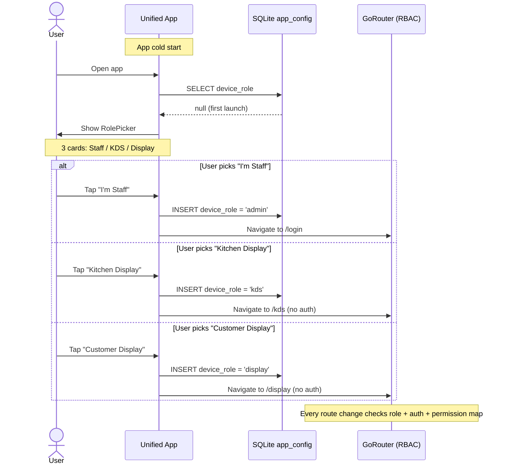

# Single-App Role Overview

> **Status:** Complete (Phase 1). The four previously-separate apps (Admin, Waiter, KDS, Display) are now a single Flutter binary with role-based UI dispatch. See [Single-App Architecture](../architecture/single-app-architecture.md) and [Reconstruction History](../development/reconstruction-history.md).

Eatery runs as a **single Flutter binary** that presents four distinct UIs depending on the device's configured role. The same APK/IPA installed on every device behaves differently based on a first-launch role picker. All roles share a common core (`packages/eatery_core`) and a unified GoRouter with role-based access control.

## The Four Roles

### Admin

The primary restaurant management interface. Full POS, menu management, customer database, payment processing, staff management, dining table floor plan, reports, settings, and backup/restore. Runs on a dedicated terminal (desktop) or tablet.

**Activation:** "I'm Staff" → login as StaffType.admin (PIN)  
**Screens:** Login → Dashboard → POS → Cart → Order confirmation → Orders list → Order detail → Customers → Payments → Dining tables → Products → Categories → Staff → Settings → Backup/restore → Reports  
**RBAC:** Wildcard `*` — access to all 50+ routes

### Waiter

Wireless order-taking interface for floor staff. Lightweight, focused on table management and order entry. Syncs with Admin for menu data and sends orders in real time over the local network.

**Activation:** "I'm Staff" → login as StaffType.waiter (PIN)  
**Screens:** Login → Table overview → Table detail → Menu → Cart → Order confirmation → Orders list  
**RBAC:** Restricted to 9 route names (tables, menu, cart, orders, viewOrder, orderConfirmation, orderPrint, customers, viewCustomer)

### Kitchen Display (KDS)

Real-time order feed for chefs. Displays incoming KOTs (kitchen order tickets) grouped by station. Supports marking items as "preparing" and "ready". Read-only on orders — no order editing.

**Activation:** "Kitchen Display" (no login required)  
**Screens:** Ticket grid → Order detail (items, modifiers, station)  
**RBAC:** 3 routes (kds, viewOrder, orderConfirmation). No authentication gate.

### Display

Customer-facing display showing order status. Placed in the dining area so customers can see when their order is being prepared, ready, or served. Read-only, no authentication needed.

**Activation:** "Customer Display" (no login required)  
**Screens:** Order status board → Order detail (items, progress)  
**RBAC:** 2 routes (display, viewOrder). No authentication gate.

## Role Dispatch Flow



## Sync Topology

```
┌─────────────────────────────────┐
│  Device A: role = admin         │  ← Sync Host
│  Runs SyncServer on :9876       │
└────────────┬────────────────────┘
             │ WebSocket
    ┌────────┼────────┬───────────┐
    │        │        │           │
    ▼        ▼        ▼           ▼
┌──────┐ ┌──────┐ ┌──────┐ ┌──────────┐
│ admin │ │waiter│ │ kds  │ │ display  │
│(other)│ │ leaf │ │ leaf │ │  leaf    │
└──────┘ └──────┘ └──────┘ └──────────┘
```

**Roles:**
- **Admin device** runs the sync server (WebSocket host on port 9876). All writes fan through it.
- **Waiter, KDS, and Display devices** connect as leaf nodes. They push their own OpLog entries and receive broadcasts from the host.

**Discovery:** mDNS service type `_eatery-sync._tcp`. Fallback: `localhost`.

**Host Election:** If the Admin host goes offline, leaf nodes detect missed heartbeats (3 × 5s) and elect a new host by highest uptime + clock.

## Dependency Graph

```
eatery (single binary) ── eatery_core ── libeaterystore (FFI)
```

The single app depends on `eatery_core` for all shared code. `packages/eatery_core` is a `path:` dependency. The native `libeaterystore` (Zig/SQLite) is loaded via `dart:ffi` by `eatery_core`.

## Permission Matrix

| Role | Auth Required | Allowed Routes |
|------|---------------|----------------|
| `admin` | PIN login | `*` (wildcard — all routes) |
| `waiter` | PIN login | `tables`, `menu`, `cart`, `orders`, `viewOrder`, `orderConfirmation`, `orderPrint`, `customers`, `viewCustomer` |
| `kds` | None (kiosk) | `kds`, `viewOrder`, `orderConfirmation` |
| `display` | None (kiosk) | `display`, `viewOrder` |

## Current Status

| Role | Status | Notes |
|------|--------|-------|
| Admin | Functional | Full POS, menu, customers, payments, staff, tables, settings, backup. |
| Waiter | In progress | Pages exist (tables, menu, cart). Auth integration pending (issue 11a). |
| KDS | In progress | Ticket page exists. Order station routing planned. |
| Display | In progress | Display page exists. Read-only order status view working. |

The migration from 4 separate Melos sub-apps to a single binary was completed in Phase 1. See [Single-App Architecture](../architecture/single-app-architecture.md) for the full architectural specification.
